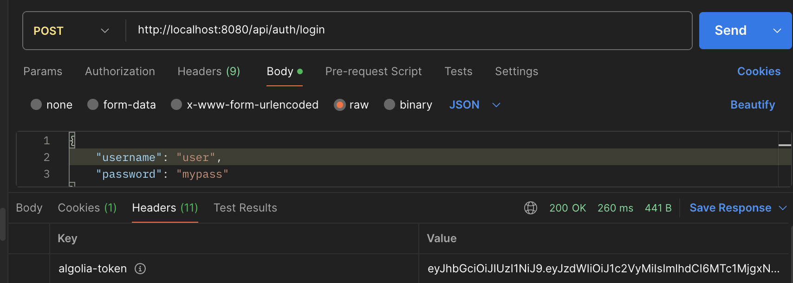
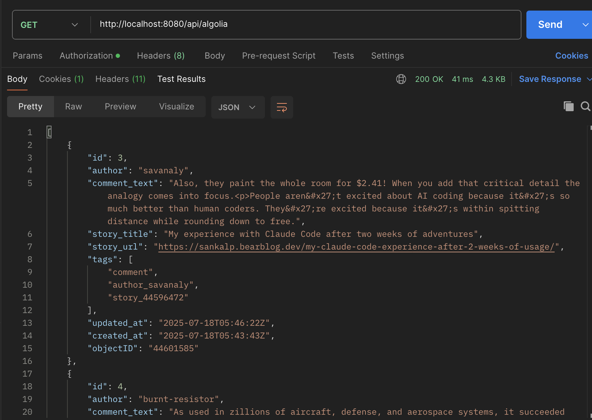
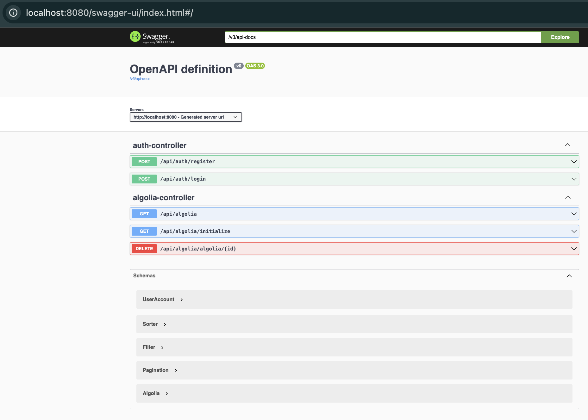

# Java Back End Developer Test

**Context**: We would like you to build a small API to test your knowledge of Java Back End Development and related technologies.

Every hour, the server should automatically make a request to the Algolia API to retrieve the data of recently published articles about [Java on Hacker News](https://hn.algolia.com/api/v1/search_by_date?query=java). It should insert the data from this API into a database and also define a REST API that the client (e.g. Postman) will use to retrieve the data. 

The service should return paginated results with a maximum of 5 items, be filterable by author, _tags, title, and also be searchable by month word (e.g. september) using the "created_at" field. It should also allow the user to remove items and not have those
should not reappear when the application is restarted.

An authorization parameter with a JWT must be sent in the headers to access the endpoints.


## STACK
You must use the following technologies to build the app:
  * JAVA 8 > + Active LTS version of Spring Boot.
  * Maven or Gradle.
  * Database: PostgreSQL or MongoDB.
  * Open JPA or Hibernate.
  * Docker.

## CONSIDERATIONS
  * The entire project must be uploaded to this repository.
  * At least 30% test coverage (statements) for the server component.
  * The artifacts (server API) must be Dockerized.
  * There should be a docker compose to start the project, using at least the server and database images.
  * Tests and linters should run on Github Actions.
  * Good use of Spring Boot.
  * Dependency injection with beans should be used.
  * API Doc: Swagger, should be exposed at /api/docs.

# -------------- APPLICATION INSTALLING --------------

# Installing

- you should use java 21 you can get it from [here](https://docs.aws.amazon.com/corretto/latest/corretto-21-ug/downloads-list.html)

- you need to use docker to start up the data base, you can use colima by running -> `brew install colima`

- you should have install docker and docker-compose:
    `brew install docker`
    `brew install docker-compose`


# Start up

there are 2 ways to start up this application:

- first option: go to the folder docker `cd docker` then run `docker-compose up mydb`. finally YOU should manually start up the application by executing `mvn clean install &&  ./run-local.sh`

- second option: first option: go to the folder docker `cd docker` then run `docker-compose up -d`. This will start up the DB + the application. 

# How to use this application
the application is pointing to port 8080 host localhost e.g. `http://localhost:8080/`

the application has the following endpoints:

- **GET** `http://localhost:8080/api/algolia`
- **GET** `http://localhost:8080/api/algolia/initialize`
- **POST** `http://localhost:8080/api/algolia/register`
- **POST** `http://localhost:8080/api/algolia/login`
- **DELETE** `http://localhost:8080/api/algolia/{id}`

now we know what are the endpoints we have exported let begin using this application.

### First Step Create an User
lets create an user, please call the endpoint 

you have 2 options to initialize this application:
- first: **POST** `http://localhost:8080/api/algolia/register` passsing by parameter a `JSON` with the following structure 

```
{
    "username": "user",
    "password": "mypass"
}
```

feel free to change the username and password values.

here there's a curl option 

```
curl --location 'http://localhost:8080/api/auth/register' \
--header 'Content-Type: application/json' \
--header 'Cookie: JSESSIONID=B2CF14A5EFDCF9AD60529F5392456881' \
--data '{
    "username": "user",
    "password": "mypass"
}'

```
### Second Step Login
you must login into the application so please call the login endpoint  **POST** `http://localhost:8080/api/algolia/login`
passsing by parameter a `JSON` with the following structure 

```
{
    "username": "user",
    "password": "mypass"
}
```
here there's a curl option 

```
curl --location 'http://localhost:8080/api/auth/login' \
--header 'Content-Type: application/json' \
--header 'Cookie: JSESSIONID=B2CF14A5EFDCF9AD60529F5392456881' \
--data '{
    "username": "user",
    "password": "mypass"
}'
```

once you execute that endpoint it must return a header under the name `algolia-token` with a token. This is the **JWT** token you must use to execute any `/api/algolia/` endpoint

this **JWT** token expire in 1 hour



### Third Step Initialize the System

you have two options:

- fist option: with the application running wait until it turn to a new hour.
e.g.: lets supose it's 3:43 PM, then wait until 4 o'clock.
the system automatically will populate the DB

- second option: execute the following endpoint **GET** `http://localhost:8080/api/algolia/initialize` -> remember add the token we got on step 2 

### Fourth Step Get Data
request **GET** `http://localhost:8080/api/algolia` -> remember add the token we got on step 2 



the endpoint suppor all this filters:

- filter by field -> this support multiple fields. They are exclusive (they are concated by the operator `AND`). 
    - *authorName*
    - *tags*
    - *title*
    - *month*

- pagination
    - *size* 
    - *offset* -> number of records to skip

- sorting
    - *sortField* -> you can sort by any Algolia (except tag) property field see -> Algolia.java. 
    - *sortOrder* -> asc/desc

by calling the enpoint without any parameter it is going to return only **5 records**

here are some examples of how you cal call this endpoints with all these filters

#### Single filter
`http://localhost:8080/api/algolia?sortField=id&sortOrder=desc&offset=5&size=3&month=JULY`

#### multi filters -> filtering by author and month
`http://localhost:8080/api/algolia?sortField=id&sortOrder=asc&offset=0&size=13&month=JULY&authorName=reactordev`

### Fifth Step delete data

use this enpoint to remove a record by record ID **DELETE** `http://localhost:8080/api/algolia/{id}` -> remember add the token we got on step 2 

example: `http://localhost:8080/api/algolia/algolia/20`


# Swagger
this is the link where you can connect to swagger ->`http://localhost:8080/api/docs`

introduce the username and password you crated in case it asks you to log in.



# General information
The application is 100% running in **Docker** where the db is automatically generated when the image is srated up for first time

the filter is super dynamic and scalable and the sorting is super flexible. You can also extend o reduce the limit of records to see.
All the filters you asked for are included + you can filter by month  (e.g July)

I included **JWT** for authentication 

the database I chose was Postgres + hibernate